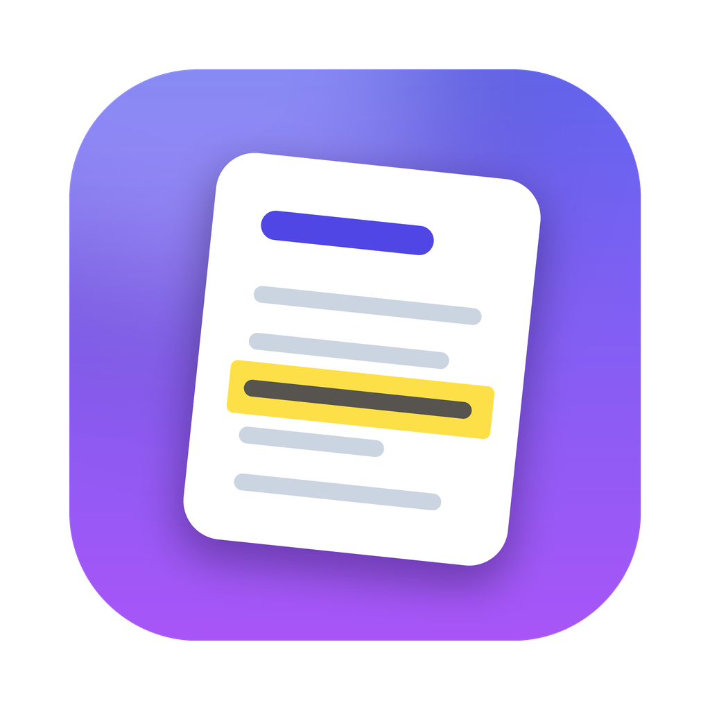

<p align="center"></p>

# NoteIt

Eine schnelle Notiz-App für macOS im Stil von **nvALT** / Notational Velocity, geschrieben in Swift (SwiftUI + AppKit).

**Version 0.2.1** · © 2026 Patrick Walter · [www.gummipunkt.eu](https://www.gummipunkt.eu) · [noteit@gummipunkt.eu](mailto:noteit@gummipunkt.eu) · Lizenz: [GPL 3.0](LICENSE)

Quellcode: <https://github.com/gummipunkt/NoteIt>

## Neue Notiz anlegen

- **Schnellster Weg (wie nvALT):** Oben ins Suchfeld klicken (oder ⌘L), einen Titel tippen und ⏎ drücken. Gibt es noch keine Notiz mit diesem Titel, wird sie angelegt und du schreibst direkt weiter.
- **Per Knopf oder ⌘N:** Der Knopf „Neue Notiz“ (Stift-Symbol) in der Symbolleiste legt eine „Neue Notiz“ an. Den markierten Titel überschreibst du einfach und bestätigst mit ⏎.
- Umbenennen geht jederzeit über den großen Titel über dem Text (oder ⌘R).

## Funktionen

- **Ein Feld für Suchen und Erstellen**: Beim Tippen wird die Liste live gefiltert. ⏎ öffnet die Notiz mit genau diesem Titel oder legt sie neu an.
- **Modernes macOS-Design**: Seitenleiste mit Notizliste (Titel, Datum, Vorschautext), Suchfeld in der Symbolleiste, großer bearbeitbarer Titel, zentrierte Textspalte, heller und dunkler Modus. Mit ↑/↓ blätterst du direkt aus dem Suchfeld durch die Notizen.
- **Markdown-Hervorhebung beim Schreiben**: Überschriften, **fett**, *kursiv*, Code, Listen, Aufgaben und Links sind schon im Editor erkennbar. Als Schrift stehen SF Pro, New York (Serif) oder SF Mono zur Wahl.
- **Drei Ansichten**: Schreiben, Geteilt (Editor + Vorschau) und Vorschau (⌘1 · ⌘2 · ⌘3).
- **Automatisches Speichern**: Es gibt keinen Speichern-Knopf. Änderungen landen nach kurzer Tipp-Pause auf der Platte, außerdem beim Wechsel der Notiz und beim Beenden.
- **Klartextdateien**: Jede Notiz ist eine `.md`- oder `.txt`-Datei, der Dateiname ist der Titel. Vorhandene Dateien im Ordner werden einfach mitgelesen.
- **Markdown-Vorschau**: Die Vorschau aktualisiert sich live, unterstützt GitHub-Markdown (Tabellen, Durchstreichen, Code) und folgt dem hellen bzw. dunklen Modus.
- **Wiki-Links**: `[[Andere Notiz]]` oder `[[Andere Notiz|Anzeigetext]]` sind in der Vorschau anklickbar. Links auf noch nicht vorhandene Notizen erscheinen rot gestrichelt und legen die Notiz beim Klick an.
- **Sync mit Dropbox und Google Drive**: Leg den Notizordner in den Dropbox- oder Google-Drive-Ordner. Die Einstellungen erkennen beide automatisch. Änderungen von außen erscheinen sofort (über FSEvents).
- **Sync mit Simplenote**: Beidseitige Synchronisation über die Simperium-API. Sie läuft automatisch alle 3 Minuten und kurz nach Änderungen.

## Tastenkürzel

| Kürzel | Aktion |
|---|---|
| ⌘N | Neue Notiz (nimmt den Suchtext als Titel, falls vorhanden) |
| ⌘L | Zum Suchfeld |
| ⏎ im Suchfeld | Notiz öffnen oder erstellen, danach weiter im Editor |
| ↑ / ↓ im Suchfeld | Vorherige / nächste Notiz |
| Esc | Suche leeren, zurück ins Suchfeld |
| ⌘R | Titel bearbeiten (umbenennen) |
| ⌫ in der Liste | Notiz in den Papierkorb legen |
| ⌘1 · ⌘2 · ⌘3 | Schreiben · Geteilt · Vorschau |
| ⌘⇧S | Mit Simplenote synchronisieren |
| ⌘, | Einstellungen |

## Bauen und Starten

Voraussetzung ist macOS 14 oder neuer mit Xcode (bzw. den Xcode Command Line Tools).

```bash
# zum Entwickeln starten (baut, signiert und startet)
scripts/run.sh

# oder ein richtiges App-Bundle nach build/NoteIt.app bauen
scripts/build-app.sh            # für diesen Mac
scripts/build-app.sh universal  # Apple Silicon + Intel
```

**Schlüsselbund-Abfrage bei jedem Start?** macOS merkt sich „Immer erlauben“ anhand der Code-Signatur. `swift run NoteIt` signiert bei jedem Neubau nur ad hoc, deshalb wirkt die App jedes Mal wie ein neues Programm. `scripts/run.sh` und `scripts/build-app.sh` verwenden automatisch dein Apple-Development-Zertifikat, falls eines vorhanden ist. Dann genügt ein einziges „Immer erlauben“. Das Zertifikat bekommst du kostenlos: Xcode → Einstellungen → Accounts → Apple-ID hinzufügen → „Manage Certificates…“ → „+“ → „Apple Development“. Ein bestimmtes Zertifikat erzwingst du mit `CODESIGN_IDENTITY="Apple Development: …" scripts/run.sh`.

Alternativ öffnest du `Package.swift` in Xcode, wählst das Schema **NoteIt** und drückst ⌘R.

Jeder Push baut die App außerdem per GitHub Actions. Das fertige `NoteIt.zip` und Bildschirmfotos liegen dann als Artefakte am jeweiligen Workflow-Lauf.

Die Versionsnummer steht an genau einer Stelle, in `Sources/NoteIt/AppInfo.swift`. Das Build-Skript übernimmt sie ins App-Bundle, die Build-Nummer ist die Anzahl der Commits. Änderungen stehen im [CHANGELOG](CHANGELOG.md). Veröffentlichte Versionen sind als Git-Tags markiert (`v0.1.0`, `v0.2.0`, …).

Beim ersten Start liegen die Notizen in `~/Documents/NoteIt`, dort wartet auch eine kurze Willkommens-Notiz. Unter **Einstellungen → Speicherort** kannst du das ändern.

## Simplenote

Unter **Einstellungen → Simplenote** meldest du dich mit E-Mail und Passwort an. Gespeichert wird nur ein Zugriffstoken im macOS-Schlüsselbund, nicht das Passwort.

So werden die Notizen abgebildet:

- Die erste Zeile einer Simplenote-Notiz wird zum Titel und damit zum Dateinamen. Ein führendes `# ` wird dabei entfernt, bleibt in Simplenote aber erhalten.
- Der Rest wird zum Dateiinhalt.
- In Simplenote als Markdown markierte Notizen werden zu `.md`-Dateien. Umgekehrt werden `.md`-Dateien in Simplenote als Markdown markiert.

So werden Konflikte und Löschungen behandelt:

- Wurde eine Notiz auf beiden Seiten geändert, schickt NoteIt die lokale Fassung relativ zur zuletzt synchronisierten Version. Simperium führt dann beide Änderungen zusammen. Klappt das nicht, bleibt deine lokale Fassung als „Titel (Konflikt)“ erhalten.
- Löschst du eine Notiz lokal, landet sie im Simplenote-Papierkorb.
- Wird eine Notiz in Simplenote gelöscht, wandert die Datei in den macOS-Papierkorb.
- Bei Änderung auf der einen und Löschung auf der anderen Seite gewinnt immer die Änderung.

Welche Notiz zu welcher Datei gehört, merkt sich NoteIt unter `~/Library/Application Support/NoteIt/`, und zwar getrennt pro Notizordner.

## Aufbau

```
Sources/NoteItCore/        plattformunabhängige Logik (läuft und testet auch unter Linux)
  Note.swift               Datenmodell
  NoteFileStore.swift      .md/.txt-Dateien lesen, schreiben, umbenennen, löschen
  NoteSearch.swift         nvALT-Suche und Sortierung
  WikiLinks.swift          [[Wiki-Links]] finden und in Markdown-Links umwandeln
  MarkdownRenderer.swift   Markdown → HTML (swift-markdown / cmark-gfm)
  Simplenote/              Simperium-Client und Sync-Engine
Sources/NoteIt/            die macOS-App (SwiftUI + AppKit)
Tests/NoteItCoreTests/     Tests, u. a. für den Sync mit einem simulierten Simperium-Server
```

Das App-Icon wird mit `scripts/make-icon.py` gezeichnet (braucht Pillow).

Tests:

```bash
swift test                # auf dem Mac
scripts/test-linux.sh     # Kern-Tests in Docker unter Linux
```

## Lizenz

Copyright © 2026 Patrick Walter · [www.gummipunkt.eu](https://www.gummipunkt.eu) · [noteit@gummipunkt.eu](mailto:noteit@gummipunkt.eu)

NoteIt ist freie Software: Du kannst es unter den Bedingungen der **GNU General Public License, Version 3**, wie von der Free Software Foundation veröffentlicht, weitergeben und/oder verändern.

NoteIt wird in der Hoffnung verbreitet, dass es nützlich ist, aber **ohne jede Gewährleistung**, sogar ohne die implizite Gewährleistung der Marktreife oder der Eignung für einen bestimmten Zweck. Details stehen in der Datei [LICENSE](LICENSE).
